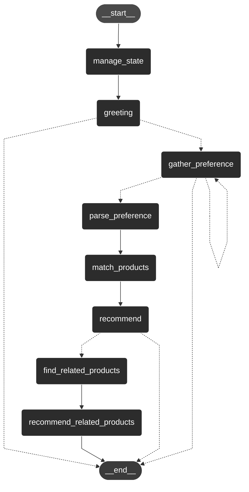

# ai-shopping-buddy
An e-commerce conversational chatbot that gathers customer preferences to provide personalized product recommendations. 
Developed for "Generative AI World Cup 2024: So you think you can hack" by Databricks.

## Agent Graph
The graph below illustrates the implemented logic of the shopping buddy's agentic service.



## ☁️ Databricks Setup

1. Refer to "Accessing the Dataset" section to obtain access to the dataset
2. Get the Serving endpoints of `databricks-meta-llama-3-1-70b-instruct` on databricks
3. Run `vectorstore/create_vectorstore.py`
4. Execute the `main.py` notebook, which serves as the entry script for the chatbot, to start chatting.

## 🗂️ Dataset

The [Best Buy Products Dataset](https://dbc-dc755886-ab40.cloud.databricks.com/marketplace/consumer/listings/55c3365c-0a3b-403b-a8e0-73fca0469fff?o=2368250103410450)
is used. It is a sample dataset obtained from Databricks Marketplace.

### Data Fields
Here are the key fields in the dataset, omitting unused columns:
```
Schema({
    'product_id': Int64,
    'title': String,
    'images': String,
    'final_price': String,
    'discount': String,
    'initial_price': String,
    'root_category': String,
    'features_summary': String,
    'features': String,
    'product_specifications': String,
})
```

### Accessing the Dataset
To access the dataset on databricks, follow these steps:
1. Go to [Best Buy Products Dataset](https://dbc-dc755886-ab40.cloud.databricks.com/marketplace/consumer/listings/55c3365c-0a3b-403b-a8e0-73fca0469fff?o=2368250103410450)
2. Click `Get Instant Access`
3. Set Catalog name as `bright_data_best_buy_products_dataset`

The data will be available as `bright_data_best_buy_products_dataset.datasets.best_buy_products`

### Acknowledgments
This dataset is provided by Bright Data. All rights reserved. 

We would like to thank Bright Data for making this data available for research and development purposes. For more information about Bright Data, please visit their [official website](https://brightdata.com).
