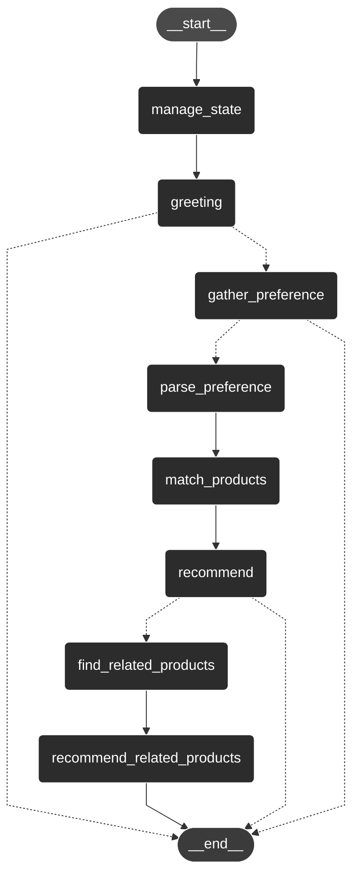

# Agent Graph
The graph below illustrates the implemented logic of the shopping buddy's agentic service. Additional elements will be included to finalize the graph and provide a complete product recommendation.

Currently, the graph captures the process of obtaining customer preferences.

